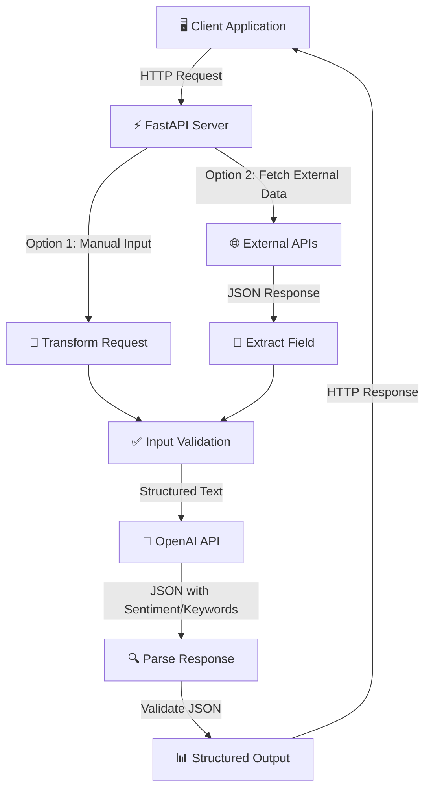

# AI Data Transformation Pipeline

AI-powered backend service that transforms unstructured text into structured insights using OpenAI and FastAPI.

## Problem

Many applications receive large amounts of unstructured text data such as customer feedback, reviews, support tickets, and survey responses

This project demonstrates how AI can automatically extract meaningful insights from raw text and return structured JSON data that can be consumed by downstream applications.

## Architecture

```
┌─────────────┐
│   Client    │
└──────┬──────┘
       │
       ▼
┌─────────────────────┐
│   External APIs     │  (NewsAPI, JSONPlaceholder, etc.)
└─────────────────────┘
       │
       ▼
┌─────────────────────┐
│   FastAPI Server    │  (Data Fetch & Validation)
└──────┬──────────────┘
       │
       ▼
┌─────────────────────┐
│   OpenAI API (GPT)  │  (AI Transformation)
└──────┬──────────────┘
       │
       ▼
┌─────────────────────┐
│  Response Layer     │  (JSON Output)
└─────────────────────┘
```

**Flow**: Client → FastAPI → External API/Manual Input → Data Validation → OpenAI → Structured JSON Response

### System Components



### Data Flow Sequence

```
1. Client sends request (text or API URL)
2. FastAPI validates input
3. If API URL: Fetch external data & extract field
4. If manual text: Use directly
5. Create structured prompt for OpenAI
6. Send to GPT-4 with JSON schema
7. Parse JSON response
8. Validate against Pydantic model
9. Return structured response to client
```

## Tech Stack

* Python
* FastAPI
* OpenAI API
* Pydantic
* Uvicorn
* Python Dotenv

## Features

* Sentiment Analysis
* Keyword Extraction
* Automatic Text Summarization
* JSON Response Validation
* Error Handling
* Environment-Based Configuration

## Data Transformation Flow

1. **Fetch Data**: Retrieve unstructured data from external APIs or manual input
2. **Validate**: Ensure data meets requirements (non-empty, proper format)
3. **Transform**: Send data to OpenAI with structured prompt
4. **Parse**: Extract structured JSON from AI response
5. **Return**: Send validated JSON response to client

## API Endpoints

### 1. POST /transform

Transform manually provided text into structured insights.

**Request:**
```json
{
  "text": "The customer support was excellent and resolved my issue quickly."
}
```

**Response:**
```json
{
  "original_text": "The customer support was excellent and resolved my issue quickly.",
  "sentiment": "positive",
  "keywords": [
    "customer support",
    "issue resolution"
  ],
  "summary": "Customer is satisfied with the support experience."
}
```

### 2. POST /fetch-and-transform

Fetch data from external APIs and automatically transform it.

**Request:**
```json
{
  "url": "https://jsonplaceholder.typicode.com/posts/1",
  "extract_field": "body"
}
```

**Response:**
```json
{
  "source_url": "https://jsonplaceholder.typicode.com/posts/1",
  "original_text": "[fetched text from API]",
  "sentiment": "positive",
  "keywords": ["keyword1", "keyword2"],
  "summary": "Summary of the fetched content."
}
```

## Run Locally

```bash
pip install -r requirements.txt

uvicorn app.main:app --reload
```

Swagger UI:

http://127.0.0.1:8000/docs

## Key Learnings

* **Prompt Engineering**: Crafting structured prompts for consistent JSON output
* **FastAPI Development**: Building fast, async REST APIs with automatic documentation
* **OpenAI API Integration**: Real-time LLM integration with error handling
* **JSON Data Transformation**: Converting unstructured data to structured formats
* **Backend Service Design**: Multi-layer architecture with validation and error handling
* **External Data Integration**: Fetching and processing data from third-party APIs
* **System Design Thinking**: Building scalable, maintainable AI-powered services